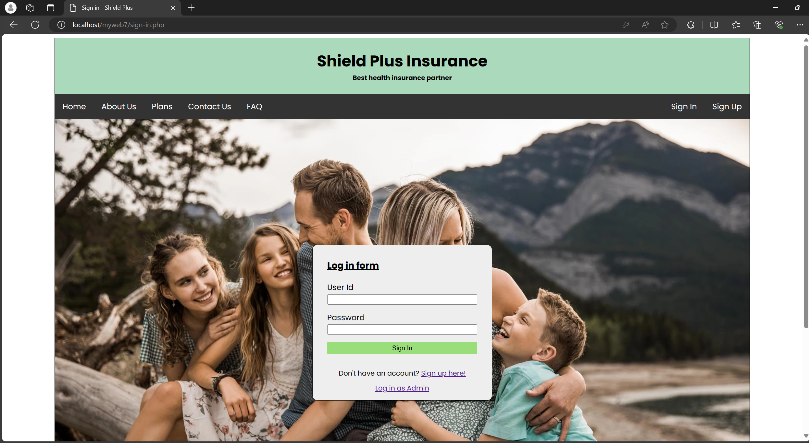
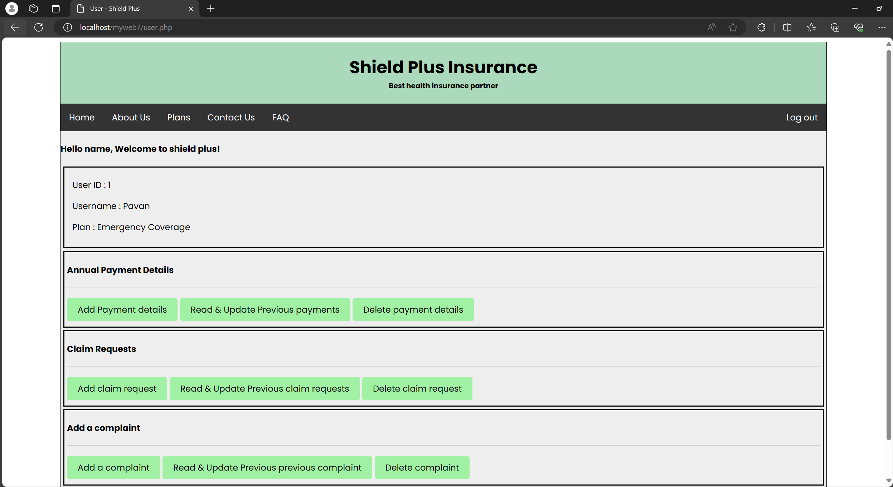
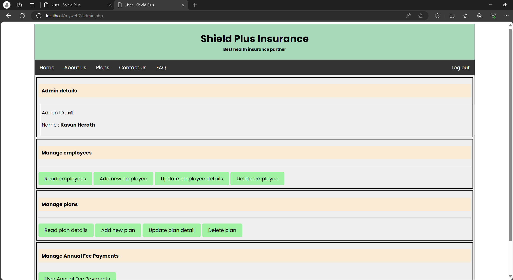
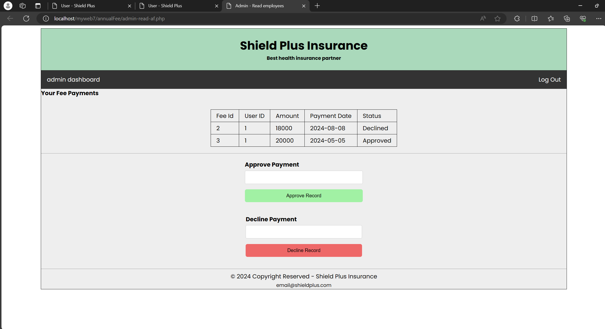
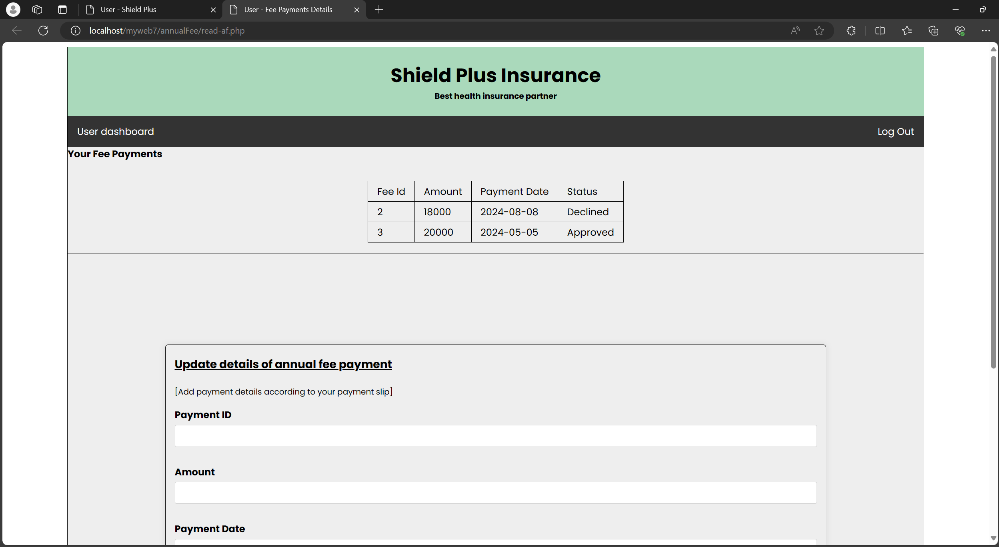

# University First year group project 

## Shield Plus Health Insurance Management System

We have done this project for IWT(Internet and Web Technologies) module in first year second semester. We have used PHP, MySQL, HTML, JavaScript and CSS to develop this web applicaiton.

_Home page of Shield Plus_

## Functionalities that we implemented 

New user can register in the system. Register user can log into the system.

## How to install this project on your local repository

1. Install xampp or laragon
    * make sure that Apache and MySQL running correctly
2. Clone the repository
3. Open the folder using VS Code or whatever code editor you're using
4. Implement the database
    * Direct to sql/database.sql and copy the whole sql query
    * Open a web browser and direct to localhost/phpmyadmin
    * Create a database called 'shield_plus' and execute the query
5. Fix the database connection
    * Direct to inc/connection.php file
    * Change the `$dbpass` (if you log in to phpMyAdmin without any password `$dbpass='';`)
6. Run the web application
    * Run the URL on browser <b>localhost/myweb7/home.php</b> 
    (Replace <b>myweb7</b> with local folder name)

## Known issues 

1. User registration page.
    * Not implemented re-enter password
    * User are not asked to accecpt terms & conditions
    * If user email alredy exists, there is no validation method [two users can have same email / primary key of the user table is userId given by system]
    * Validate user entered phone number 

2. User log in form
    * If entered invalid userId then system will not display "user doesnot exist"  
    * If user fogot password, user cannot reset their password

## Screenshots of webpages

_User log in page_

_User dashboard_

_Admin dashboard_

_Admin payment manage page_

_User fee payment page_

